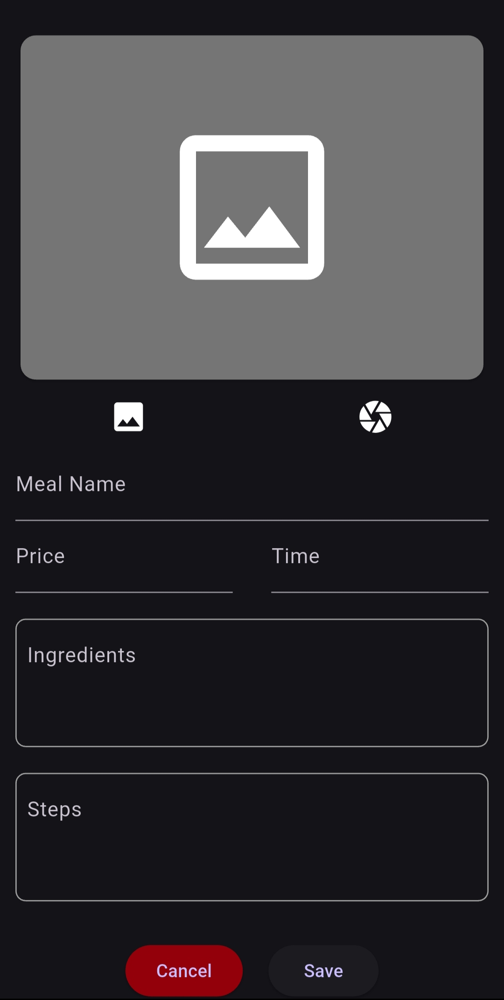

# CookMate 🍳

A Flutter-based mobile application to discover, save, and manage your favorite recipes. CookMate allows you to browse existing meals and add your own, complete with ingredients, steps, and photos.

## ✨ Features

- **Discover Meals**: Browse a list of meals on a clean and simple home screen.
- **Meal Details**: View detailed recipe information including ingredients, preparation steps, cooking time, and price.
- **Add Your Own Recipes**: Easily add new meals with a user-friendly form.
- **Image Upload**: Add a personal touch by uploading a picture for your meal from the gallery or taking a new one with the camera.
- **Smart Text Inputs**: Automatically numbered lists for ingredients and steps for a smooth data entry experience.
- **Local Storage**: Your custom recipes are saved directly on your device for offline access using a local `sqflite` database.
- **State Management**: Built using `Riverpod` for efficient and scalable state management.
- **Custom UI**: Features a custom animated splash screen using `Lottie` and a polished UI with `Google Fonts`.


| Home Screen | Details Screen |
|:---:|:---:|
|  |  |
| **Add Meal Screen** | |
|  | |


## 🛠️ Technologies Used

- **Framework**: [Flutter](https://flutter.dev/)
- **State Management**: [Flutter Riverpod](https://riverpod.dev/)
- **Database**: [sqflite](https://pub.dev/packages/sqflite) for local persistence.
- **Animations**: [Lottie](https://pub.dev/packages/lottie) for the splash screen animation.
- **Image Handling**: [image_picker](https://pub.dev/packages/image_picker)
- **Icons**: [flutter_launcher_icons](https://pub.dev/packages/flutter_launcher_icons)
- **UI Components**: [google_fonts](https://pub.dev/packages/google_fonts), [carousel_slider](https://pub.dev/packages/carousel_slider), [smooth_page_indicator](https://pub.dev/packages/smooth_page_indicator)

## 🚀 Getting Started

To get a local copy up and running, follow these simple steps.

### Prerequisites

Make sure you have Flutter installed on your machine.
- [Flutter Installation Guide](https://docs.flutter.dev/get-started/install)

### Installation

1. Clone the repo:
   ```sh
   git clone https://github.com/YouseefSaeed1/CookMate.git
   ```
2. Navigate to the project directory:
   ```sh
   cd cookmate
   ```
3. Install dependencies:
   ```sh
   flutter pub get
   ```
4. Generate the app launcher icons:
   ```sh
   flutter pub run flutter_launcher_icons
   ```
5. Run the app:
   ```sh
   flutter run
   ```
